<div align="center">


<a href="https://github.com/OpTiMuS-mov">
  
</a>

<br/>


<br/><br/>

> *"Breaking things to understand them, then building them better."*

---

</div>

## 👨‍💻 About Me

```yaml
name: "Avinash Kotarya"
country: "India 🇮🇳"
education: "B.Tech in Computer Science Engineering (Cyber Security)"
college: "IPS Academy, Indore"

current_focus:
  - "Blue Team / SOC Operations"
  - "Cybersecurity"
  - "Windows Security"
  - "Networking"
  - "Python Automation"

roles:
  - "PR Lead @ Netryx"
  - "Video Editing Head @ Netryx"

passionate_about:
  - "Blue Team & SOC"
  - "Incident Response"
  - "Threat Detection"
  - "Ethical Hacking"
  - "Linux Security"
  - "Networking"
  - "Automation"
  - "Open Source"
  - "UI Design"
  - "Video Editing"

currently_learning:
  - "SOC Operations"
  - "Security Monitoring & Alert Analysis"
  - "Incident Response"
  - "MITRE ATT&CK"
  - "Security Playbooks"
  - "Windows Internals & Security"
  - "Threat Hunting Fundamentals"
  - "SIEM Fundamentals"
  - "Malware Analysis"
  - "Active Directory"
  - "Penetration Testing"
```

---

## 🛠️ Tech Stack

**Languages**


**Operating Systems**


**Development Tools**


**Cybersecurity Toolkit**


<details>
<summary><b>🛡️ Blue Team / SOC Skills</b></summary>
<br/>

- SOC Operations Fundamentals
- Security Monitoring
- Alert Analysis
- Incident Investigation
- Incident Response Fundamentals
- Security Playbooks
- MITRE ATT&CK Mapping
- Credential Compromise Analysis
- Windows Security & Internals
- Endpoint Investigation
- Network Traffic Analysis
- Threat Hunting Fundamentals
- SIEM Fundamentals
- Log Analysis
- Malware Analysis Fundamentals
- Security Event Investigation

</details>

<details>
<summary><b>🔐 Offensive Security Skills</b></summary>
<br/>

- Reconnaissance
- DNS Enumeration
- Port Scanning
- Web Security
- Security Headers
- SSL/TLS Analysis
- Vulnerability Assessment
- Penetration Testing Fundamentals
- Linux Security
- Network Security

</details>

---

## 🚀 Featured Projects

<div align="center">

### 🔎 [OptimumXRecon](https://github.com/OpTiMuS-mov/OptimumXRecon)

Python-based reconnaissance toolkit built for fast, automated recon.

`DNS Lookup` · `WHOIS Lookup` · `SSL Certificate Scanner` · `HTTP Security Header Analysis` · `Port Scanner` · `Rich CLI` · `Automation`


</div>

**🌐 Portfolio Website** — [optimus-mov.github.io/My-Portfolio](https://optimus-mov.github.io/My-Portfolio/)
A personal portfolio showcasing projects, skills, and background.

**📡 IoT Smart Doorbell Notification System** *(Academic Project)*
An IoT-based smart doorbell that sends real-time notifications, built as part of coursework.

---

## 🧪 Hands-On Cybersecurity Learning

### 🛡️ Let'sDefend — SOC Training

Currently building practical SOC experience through hands-on investigations and security operations labs.

`Alert Analysis` · `Incident Investigation` · `SOC Workflows` · `Security Playbooks` · `MITRE ATT&CK` · `Credential Analysis` · `Threat Detection`

Working through realistic security scenarios to strengthen investigation, detection, and incident-response skills.

---

## 🎯 Interests

`Blue Team` · `SOC` · `Cybersecurity` · `Incident Response` · `Threat Detection` · `Linux` · `Networking` · `Python` · `Automation` · `Ethical Hacking` · `Video Editing` · `UI Design` · `Gaming`

**Currently Gaming:** Valorant 🎯 · Elden Ring ⚔️

---

## 📊 GitHub & Learning Status

<div align="center">




### 🛡️ SOC Training Status

| 🧪 Training Platform | 🎯 Current Focus | 📡 Status |
|---|---|---|
| **Let'sDefend Labs** | Alert Analysis · Incident Investigation · SOC Workflows | **Actively Learning** |
| **Blue Team Journey** | Detection · MITRE ATT&CK · Incident Response | **In Progress** |
| **Current Mission** | Building practical investigation skills every day | **🟢 Active** |

</div>

> **Current status:** Learning, investigating, and building practical cybersecurity skills through hands-on SOC labs.

---

<details>
<summary><b>📈 Activity Graph</b></summary>
<br/>


</details>

<details>
<summary><b>🏆 Trophies</b></summary>
<br/>


</details>

<details>
<summary><b>🐍 Contribution Snake (setup required)</b></summary>
<br/>

To enable this, add a GitHub Action from [Platane/snk](https://github.com/Platane/snk) to your profile repo — it generates `github-contribution-grid-snake-dark.svg` automatically on a schedule.

```md

```

</details>

---

## 💻 Terminal

```bash
optimus@parrot:~$ whoami
Avinash Kotarya

optimus@parrot:~$ neofetch --minimal
OS: Parrot OS
Editor: VS Code
Languages: Python, C++
Focus: Blue Team, SOC, Cybersecurity
Secondary: Kali Linux
Project: OptimumXRecon

optimus@parrot:~$ echo "status"
> Learning, investigating, building — every day.
```

---

## 🎯 Currently Working On

- 🛡️ Blue Team & SOC Operations
- 🔎 Security Alert Analysis
- 🚨 Incident Response & Investigation
- 🧠 MITRE ATT&CK
- 📋 SOC Playbooks
- 🪟 Windows Security & Internals
- 🌐 Networking & Traffic Analysis
- 🧪 Let'sDefend SOC Labs
- 🔒 Python Security Automation
- 🐧 Linux Security with Parrot OS & Kali Linux
- 🤝 Open Source Contributions
- 📚 Learning Advanced Penetration Testing

---

## 📫 Connect With Me

<div align="center">

[](https://github.com/OpTiMuS-mov)
[](https://www.linkedin.com/in/avinash-kotarya-0a37b1331/)
[](https://optimus-mov.github.io/My-Portfolio/)

<br/>


</div>
